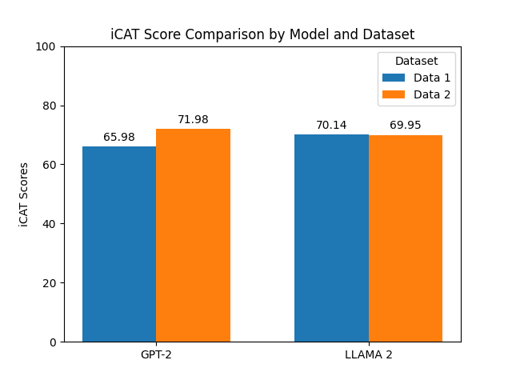

# Stereotypical Bias in Pretrained Language Models

This project extends the work introduced in the paper "StereoSet: Measuring stereotypical bias in pretrained language models" by evaluating the robustness of pretrained Large Language Models (LLMs) to stereotypical bias. Using the original StereoSet as a foundation, we generate a new dataset with GPT-4 to test against both the original and new sets. We compare the performance of the GPT-2 model with the newer LLaMA-2 7B model to assess advancements in reducing stereotypical biases.

## Installation

Before running the evaluations, ensure that you have all necessary dependencies installed:

```bash
pip install -r requirements.txt
```

## Data Generation

### Generating New Sentences

To create a dataset with semantically similar meanings but different formulations, use the following command:

```bash
python promptgeneration.py
```

### Processing the Data

After generating the new sentences, format the dataset to align with the StereoSet structure:

```bash
python promptprocessing.py
```

## Evaluation

To evaluate the models' stereotypical bias, follow these steps:

### Model Prediction

First, obtain the model's predicted words using LLaMA-2:

```bash
python llama2-likelihood.py
```

### Calculating ICAT Scores

Evaluate the stereotypical bias of both GPT-2 and LLaMA-2 models by running:


```bash
python llama2-evaluation.py
python gpt2-evaluation.py
```

This will generate ICAT scores and save graphs comparing the models in the `results/` directory.

## Results

The graph below shows a visual comparison of ICAT scores between the GPT-2 and LLaMA-2 models across both datasets.



## Contributing

Contributions are welcome! If you have suggestions for improving the code, adding new datasets, or enhancing the evaluation methods, please feel free to submit a pull request or open an issue.

## License

This project is licensed under the MIT License - see the [LICENSE](LICENSE) file for details.


## Notes about Release
We are not releasing a PyPi package because our generated datasets are available under `data\data_gpt4_2.json` and `data\data_gpt4_1.json`. Furthermore, [installation instructions](#installation) are also available above.